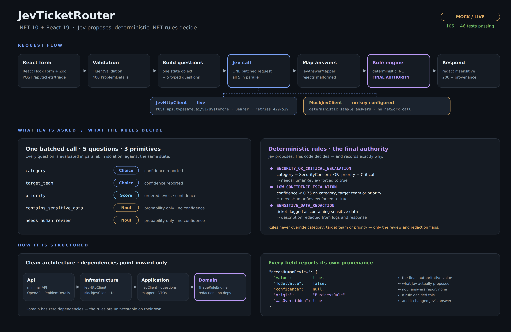
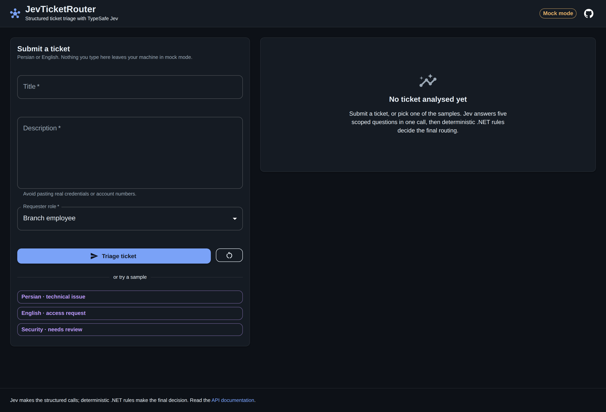
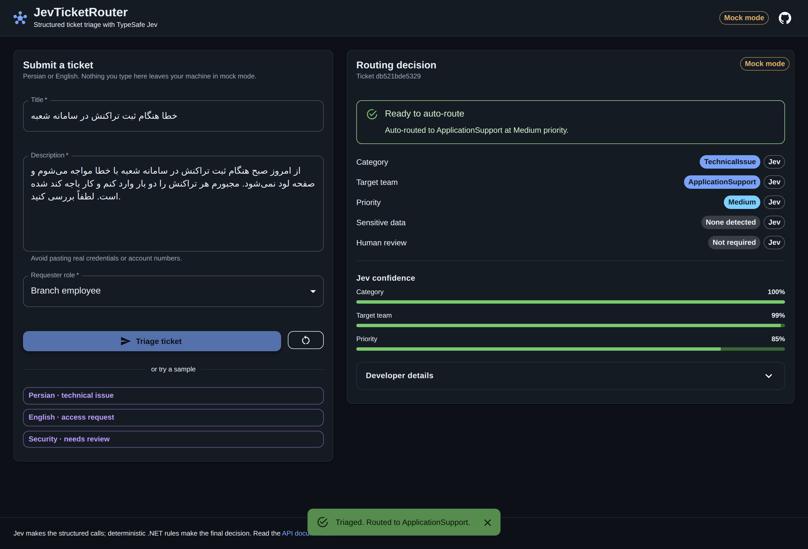
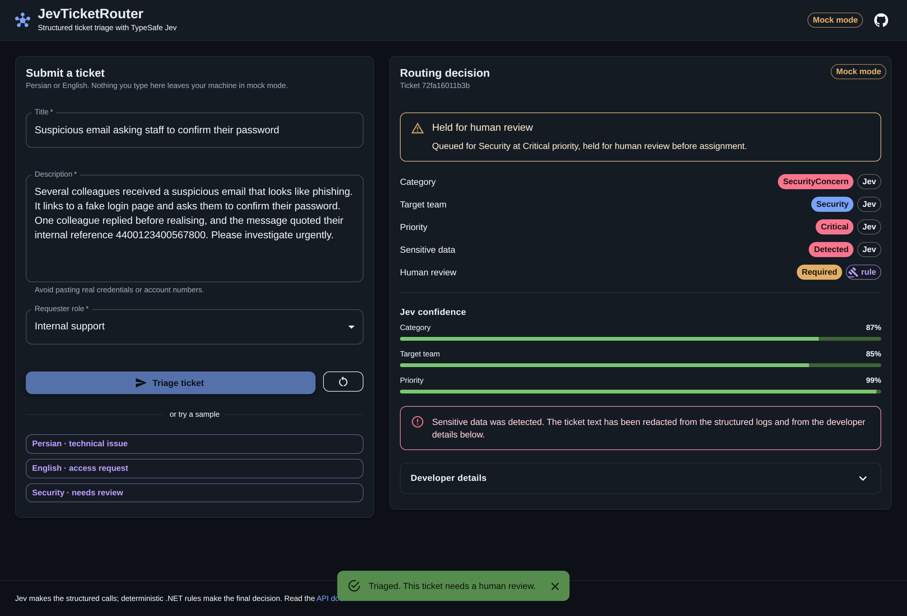
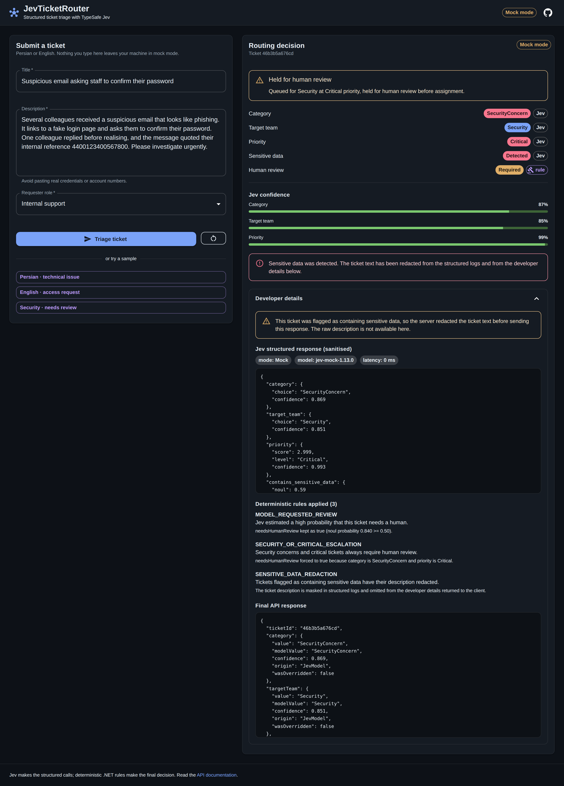
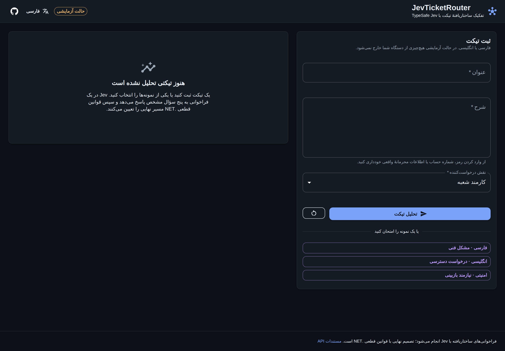
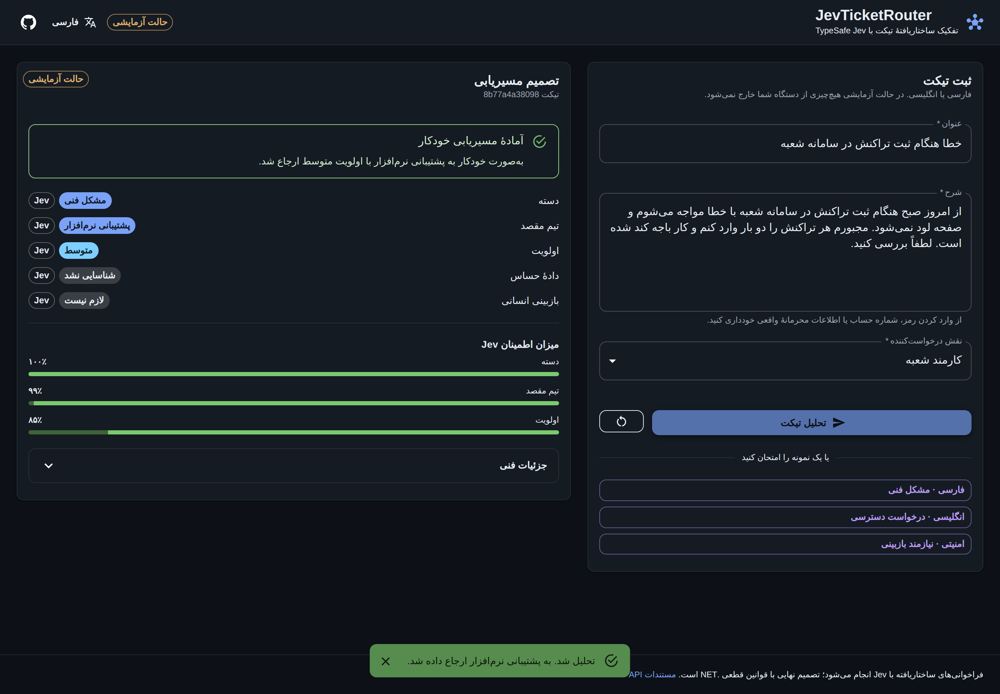
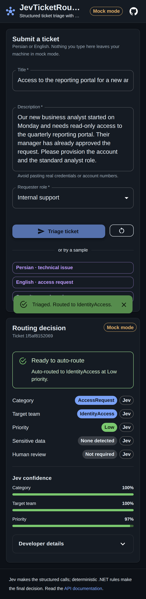

# JevTicketRouter

Structured support-ticket triage built on **.NET 10** and **React 19**, using **TypeSafe Jev** to make
fast, typed decisions and deterministic **.NET business rules** to make the final call.

A user submits a support ticket in Persian or English. The backend asks Jev five scoped questions in a
single batched call, then a deterministic rule engine decides what actually happens to the ticket.
Every field in the response says whether the value came from the model or from a rule.

> **Runs without an API key.** With no `TYPESAFE_API_KEY` configured the backend starts in a clearly
> labelled **Mock mode** and returns deterministic sample answers, so you can clone the repository and
> see the whole flow immediately.



---

## Screenshots

| Dashboard | Persian technical issue |
| --- | --- |
|  |  |

| Security case: escalated and redacted | Developer details |
| --- | --- |
|  |  |

| Persian interface, fully mirrored (RTL) | Persian routing decision |
| --- | --- |
|  |  |

<p align="center">
  
</p>

---

## Why this design

### Why Jev makes the structured calls

A support ticket is unstructured text, but routing it is a set of small, closed decisions: which
category, which team, how urgent, is anything sensitive, does a human need to look. Jev is a
*System One* model built for exactly that — you send a state and typed questions, and you get back
values your code can branch on, plus a probability distribution and a calibrated confidence for each.

This project uses all three TypeSafe primitives, one per decision, and asks them **in a single
request**. The API evaluates every question in parallel and in isolation against the same state, so
batching is both cheaper and faster than one call per question, with no change to the answers.

| Decision | Primitive | Why |
| --- | --- | --- |
| `category` | **Choice** | One option from a closed set, with a probability per option. |
| `targetTeam` | **Choice** | Same shape: a fixed roster of teams. |
| `priority` | **Score** | The four levels are *ordered*, which is what Score is for. The answer also gives a probability-weighted position between levels. |
| `containsSensitiveData` | **Noul** | A yes/no judgement, returned as a probability from 0 to 1. |
| `needsHumanReview` | **Noul** | Same: a yes/no judgement the model can express doubt about. |

Choice and Score answers carry a `confidence` value; **Noul answers deliberately do not** — the
TypeSafe API returns only a probability for them. The UI reflects that honestly and shows
`not reported` rather than inventing a number.

### Why deterministic .NET rules have the final say

The model is a good classifier, not an authority. Routing a ticket has consequences — a missed
security incident, an exposed account number, a critical outage sitting in the wrong queue — and those
consequences should be governed by code you can read, test, and audit, not by a probability.

So Jev *proposes* and `TriageRuleEngine` *disposes*:

1. **Security or critical ⇒ human review.** If the category is `SecurityConcern` or the priority is
   `Critical`, `needsHumanReview` is forced to `true` regardless of what the model thought.
2. **Low confidence ⇒ human review.** If Jev's confidence in category, target team, or priority falls
   below **0.75**, the ticket goes to a human. This is the model being allowed to say "I don't know",
   and the code acting on it.
3. **Sensitive data ⇒ redaction.** If the ticket is flagged as containing sensitive data, the
   description is masked in the structured logs and replaced with a placeholder before the response
   ever leaves the server.

Every rule that fires is recorded as an `AppliedRule` with its id, what it states, and what it
changed. The API returns those, and the UI shows them. Nothing about the outcome is unexplainable.

**Provenance is a first-class field.** Each decision comes back as:

```jsonc
{
  "value": true,            // the final, authoritative value
  "modelValue": false,      // what Jev proposed
  "confidence": null,       // Jev's confidence, or null for noul-backed fields
  "origin": "BusinessRule", // JevModel | BusinessRule
  "wasOverridden": true     // true when a rule changed Jev's answer
}
```

---

## Architecture

Clean architecture, with dependencies pointing inward only:

```
JevTicketRouter.Api             ASP.NET Core minimal API, OpenAPI, ProblemDetails, CORS
        │  depends on
        ▼
JevTicketRouter.Infrastructure  Jev / Local / Mock engines, options, resilience, DI
        │  depends on
        ▼
JevTicketRouter.Application     IDecisionEngine, IJevClient, questions, mapper, DTOs,
        │  depends on          validation, TicketTriageService (orchestration)
        ▼
JevTicketRouter.Domain          Entities, enums, TriageRuleEngine, redaction. No dependencies.
```

**The flow of one request:**

```
POST /api/tickets/triage
   │
   ├─ FluentValidation ──────────── invalid ─▶ 400 ValidationProblemDetails
   │
   ├─ JevTriageQuestions.BuildRequest()      one state + five typed questions
   │
   ├─ IJevClient.EvaluateAsync()             ── live ─▶ POST https://api.typesafe.ai/v1/systemone
   │                                         └─ mock ─▶ deterministic sample answers
   │
   ├─ JevAnswerMapper.Map()                  raw answers ─▶ domain assessment (rejects malformed)
   │
   ├─ TriageRuleEngine.Apply()               ◀── the final authority
   │
   └─ redact ─▶ structured log + 200 response
```

`IJevClient` is a thin, faithful wrapper over the documented HTTP contract, which keeps it trivial to
substitute in tests and makes the live/mock choice invisible to everything above it. TypeSafe ships
Python and JavaScript SDKs but **no .NET SDK**, so the backend calls the HTTP API directly through
`IHttpClientFactory`, with an exponential-backoff retry handler for `429` and `529` as the docs
prescribe.

---

## Features

**Backend**
- Clean architecture with enforced dependency boundaries and nullable reference types everywhere.
- **Provider-agnostic AI layer**: one `IDecisionEngine` interface and four providers (Jev,
  SelfHosted, Local, Mock), selected by `AI_PROVIDER` through dependency injection.
  See *Cloud-to-Local Migration*.
- **Local-first option**: any OpenAI-compatible endpoint inside your own network, with strict JSON
  schema output, safe validation, and a startup guard that refuses non-local addresses.
- `POST /api/tickets/triage`, `GET /api/health`, and `POST /api/benchmark`.
- A single batched Jev call using all three primitives (Choice, Score, Noul).
- Deterministic rule engine with full provenance and an audit trail of applied rules.
- Sensitive-data redaction in both logs and API responses, plus a defence-in-depth pattern mask
  (long digit runs, emails, bearer tokens, `password:`-style assignments) that applies even to
  tickets the model did *not* flag.
- `CancellationToken` throughout, configurable timeouts, resilient retries, RFC 7807 ProblemDetails.
- Structured logging that never contains the ticket description or the API key.
- Mock mode when no key is configured, clearly labelled in logs, the API, and the UI.
- OpenAPI document with worked request and response examples, served through Swagger UI.
- 236 tests across the rules, validation, redaction, answer mapping, provider selection, the
  local endpoint guard, malformed-response handling, the benchmark, and the HTTP API.

**Frontend**
- Responsive dark-mode dashboard in Material UI, no template, no utility CSS framework.
- Ticket form with React Hook Form + Zod, mirroring the server's validation rules.
- Three one-click demo tickets, all fictional.
- Result card with category, target team, priority, per-decision confidence meters, sensitive-data
  and human-review status, and the final routing summary.
- A `rule` badge wherever a deterministic rule decided a field, so model output is never mistaken for
  a business decision.
- Collapsible developer panel: sanitised Jev response, the rules that fired, and the final API
  response — never the raw description when sensitive data was detected.
- Loading, empty, and readable error states; server-side validation errors surfaced inline.
- **Fully bilingual interface (English and Persian) with real RTL support** — see below.
- Persian and English ticket text both render correctly, independently of the interface language.
- A prominent provider badge: **Live Jev**, **Local AI**, or **Mock mode**.
- 71 tests with Vitest and React Testing Library.

---

## Cloud-to-Local Migration

**Jev is the evaluation provider. Local inference is the intended production architecture for
restricted organisational data.**

A support ticket is exactly the kind of text an organisation cannot casually send to a third party:
it contains staff names, internal system names, customer references, and sometimes a credential
someone pasted without thinking. TypeSafe Jev is excellent for proving the design — it is fast,
calibrated, and purpose-built for structured decisions — but "our tickets are posted to an external
API" is a sentence that ends many internal review meetings.

So the AI provider is an implementation detail behind one interface:

```csharp
public interface IDecisionEngine
{
    Task<DecisionResult> EvaluateAsync(TicketInput input, CancellationToken cancellationToken);
}
```

Three engines implement it. Everything above the interface — the deterministic rules, the redaction
path, the API contract, the React client — is provider-agnostic and untouched by the choice.

| Engine | Provider | What it calls |
| --- | --- | --- |
| `TypeSafeJevDecisionEngine` | `Jev` | `POST https://api.typesafe.ai/v1/systemone`, one batched call using Choice, Score, and Noul. |
| `LocalOpenAiCompatibleDecisionEngine` | `Local` | `POST {LOCAL_AI_BASE_URL}/chat/completions` on a self-hosted endpoint. Never leaves your network. |
| `MockDecisionEngine` | `Mock` | Nothing. Deterministic sample answers for development. |

A fourth option reuses the Jev engine against weights you host yourself — see below.

### Self-hosted System One (circuit)

Jev itself is not open-weights, but [circuit](https://github.com/Barneyjm/circuit) is: open System
One models that answer typed questions with calibrated probabilities in a single forward pass, and
that **serve TypeSafe's `POST /v1/systemone` contract verbatim**.

That last part is why this took almost no code. The request shape, the three primitives, and the
answer shape — including the detail that `noul` answers carry no confidence — are identical, so this
provider reuses the existing client, question set, and answer mapper. Only the address changes.

Docker builds and runs the whole thing, model included. This is the entire setup — no key, no
account, and no outbound call once the weights are cached:

```bash
AI_PROVIDER=SelfHosted docker compose --profile circuit up --build
```

The first start downloads ~3.5 GB into a named volume and then loads it, which takes a few minutes
and looks idle; `docker compose --profile circuit logs -f circuit` shows the progress. Every start
after that reuses the volume. See [`tools/circuit`](tools/circuit) for the GPU build, the model
choice, and what is inside the image.

Outside Docker, with circuit checked out yourself:

```bash
# 1. Serve the model (see the circuit README for getting the weights into runs/)
git clone https://github.com/Barneyjm/circuit && cd circuit
uv sync
S1_MODEL=lora:runs/circuit-1.7b uv run python -m s1proto    # POST /v1/systemone on :8901

# 2. Point the app at it
AI_PROVIDER=SelfHosted SELF_HOSTED_BASE_URL=http://localhost:8901 \
  dotnet run --project backend/JevTicketRouter.Api
```

The header badge reads **Self-hosted**, and `GET /api/health` reports `"provider": "SelfHosted"` —
deliberately not "Jev", because saying Jev for a model you are running yourself would be exactly the
kind of false provenance this project spends so much effort avoiding.

| Model | Base | Download | Accuracy / ECE on circuit's validation split |
| --- | --- | --- | --- |
| `circuit-1.7b` (default) | Qwen3-1.7B-Base | ~3.5 GB | 0.897 / 0.016 |
| `circuit-8b` | Qwen3-8B-Base | ~16.6 GB | 0.899 / 0.020 |

The small one is the default: 0.002 behind on circuit's own numbers, for a fifth of the disk.
`CIRCUIT_MODEL=circuit-8b` switches both the weights the server loads and the model name recorded on
each decision, so the two cannot drift apart. Both runs are pinned to the revisions circuit's own
deployment pins, because an unpinned repository would change the served model the moment new weights
were pushed.

**Testing it without a GPU, or without the download.** The repository ships a stub that serves the
same contract, so the whole path can be exercised on any machine:

```bash
AI_PROVIDER=SelfHosted docker compose --profile circuit-stub up --build
```

or, without Docker:

```bash
python tools/circuit-stub/circuit_stub.py    # :8901, standard library only

AI_PROVIDER=SelfHosted SELF_HOSTED_BASE_URL=http://localhost:8901 \
  dotnet run --project backend/JevTicketRouter.Api
```

It answers confidently on recognisable text and vaguely otherwise, so both branches of the
confidence rule are reachable. See [`tools/circuit-stub`](tools/circuit-stub). It is a fixture, not
a model — the answers are keyword matches, not judgements.

**This will not work through Ollama.** The calibrated probabilities come from a pointer readout head
on top of the LoRA, and a plain GGUF conversion drops that head — the model would still answer, but
the numbers would no longer mean what they claim. Run circuit's own server.

The same endpoint guard as Local mode applies: `SELF_HOSTED_BASE_URL` must be loopback or private
unless an administrator overrides it, since running the weights yourself is pointless if the address
turns out to be someone else's server.

### Switching to Local mode

Run any OpenAI-compatible server — Ollama, vLLM, llama.cpp, LM Studio, or an internal model gateway:

```bash
# Example with Ollama
ollama serve
ollama pull qwen2.5:7b-instruct
```

Then point the backend at it:

```powershell
$env:AI_PROVIDER      = "Local"
$env:LOCAL_AI_BASE_URL = "http://localhost:11434/v1"
$env:LOCAL_AI_MODEL    = "qwen2.5:7b-instruct"
# $env:LOCAL_AI_API_KEY = "<token>"   # only if your endpoint requires one

dotnet run --project backend/JevTicketRouter.Api
```

That is the entire migration. No code change, no frontend change. The startup log states which
engine is running and why, the header badge switches to **Local AI**, and `GET /api/health` reports
`"provider": "Local"`.

### What Local mode guarantees

- **No internet calls.** One request per evaluation, to the configured endpoint only. No telemetry,
  no analytics, no cloud fallback, and no automatic model downloads. There is deliberately no
  "fall back to Jev if the local model fails" path: silently shipping a ticket to a cloud API
  because a local model timed out is precisely the failure this architecture exists to prevent.
- **Non-local endpoints are refused.** `LOCAL_AI_BASE_URL` must resolve to loopback, an RFC 1918
  private range, a link-local or unique-local address, or an internal host name. Anything else fails
  at startup with an explanatory message rather than after the first ticket has already been sent.
  An administrator can override this with `LocalAi:AllowPublicEndpoint=true` for a genuinely internal
  gateway on a routable address — deliberately, never by accident.
- **Malformed output is never repaired.** A local instruction-tuned model is far less disciplined
  than a purpose-built classifier: it may wrap JSON in prose, invent a label, omit a field, or return
  a confidence outside 0-1. Each of those is a validation failure returning `502` with a plain
  explanation. Nothing is defaulted, inferred, or guessed — a ticket routed on an invented value
  would be worse than one that failed visibly.
- **Strict schema where supported.** The request sends `response_format: json_schema` with
  `strict: true`, and the schema's enums are generated from the domain types, so adding a category
  cannot leave the schema behind. Where a server does not honour it, the engine falls back to
  `json_object` and still validates the body itself. The schema is a narrowing, never the only check.
- **The same redaction rules apply.** Sensitive tickets are redacted before logging and before
  serialisation, whichever engine decided.

### Comparing the two providers

With both configured, `POST /api/benchmark` runs a fixed corpus of **fictional** demo tickets against
each and reports latency, schema-validity rate, and how often the two reach the same final routing:

```bash
curl -X POST http://localhost:5217/api/benchmark
```

The corpus lives in code and is never taken from submitted tickets. The report identifies cases by id
and contains no ticket text, no model output, and no credential. Agreement is measured on the *final*
routing, after the deterministic rules have run — two engines differing on a confidence but landing
on the same team and priority is not a routing difference.

This is the intended migration path: run Jev and a candidate local model side by side, look at where
they disagree, pick a model whose agreement you are comfortable with, then switch `AI_PROVIDER` and
drop the cloud dependency.

---

## Internationalisation

The interface ships in **English** and **Persian (فارسی)**, switchable at runtime from the header.
The choice is remembered in `localStorage` and falls back to the browser's preferred language.

Switching to Persian does three separate things, and skipping any one of them leaves the page only
half-translated:

| Concern | How it is handled |
| --- | --- |
| Strings | `i18next` + `react-i18next`, with resources in `src/i18n/`. |
| MUI's own layout logic | `direction: 'rtl'` on the theme. |
| The emitted CSS | A second Emotion cache using `stylis-plugin-rtl`, because MUI writes physical properties such as `margin-left` that the theme alone will not flip. |
| The document | `dir` and `lang` set on `<html>`, so the browser applies the bidi algorithm and screen readers announce the right language. |
| Numbers | `Intl.NumberFormat`, so Persian shows ۸۵٪ rather than 85%. |

Two details worth calling out:

- **The ticket's language is independent of the interface's.** The text inputs carry `dir="auto"`,
  so a Persian ticket reads right-to-left even while the UI is in English, and vice versa. That is
  the whole point of the app — triage handles either language — so the demo ticket bodies are never
  translated.
- **Translations cannot silently drift.** `Messages` is derived from the English resource, so
  Persian is type-checked against it: a key added in English and forgotten in Persian is a compile
  error, not a blank label. A test also walks both trees and asserts the interpolation placeholders
  match.

Server-generated strings are treated deliberately. The user-facing routing sentence is composed in
the client from the decided fields, so it is properly localised. The `effect` line on each applied
rule is left exactly as the server wrote it — it is an audit record carrying computed values, and
belongs in a log, not in translated prose. Rule *descriptions* are keyed by the stable rule id and
translated.

Adding a third language means adding one file under `src/i18n/`, listing it in `LOCALES`, and giving
it a direction — no component changes.

---

## Prerequisites

| Tool | Version | Notes |
| --- | --- | --- |
| [.NET SDK](https://dotnet.microsoft.com/download/dotnet/10.0) | **10.0.401** or newer | `dotnet --version` |
| [Node.js](https://nodejs.org/) | **22.x LTS** or newer | `node --version` |
| npm | 10 or newer | ships with Node |
| TypeSafe API key | optional | [console.typesafe.ai](https://console.typesafe.ai/settings/keys). Without one the app runs in Mock mode. |
| [Docker](https://docs.docker.com/get-docker/) | optional | Only if you want the one-command route. See *Running with Docker*. |

---

## Running with Docker

The quickest way to see it working. One image serves both halves from one origin, so there is no
CORS setup and no reverse proxy to configure.

```bash
docker compose up --build
```

Open <http://localhost:8080>. With no API key it starts in **Mock mode**, so it works offline and
needs nothing configured.

Or without Compose:

```bash
docker build -t jevticketrouter .
docker run --rm -p 8080:8080 jevticketrouter
```

### Choosing a provider

Every mode is one command. Compose profiles keep the extra services out of the default path, so a
bare `docker compose up` stays small and quick.

```bash
# TypeSafe Jev — the hosted API.
AI_PROVIDER=Jev TYPESAFE_API_KEY=<your-key> docker compose up --build

# circuit — open-weights System One on your own hardware. No key, nothing leaves the machine.
# The first run downloads ~3.5 GB of weights into a named volume; after that it is instant.
AI_PROVIDER=SelfHosted docker compose --profile circuit up --build

# The same contract from keyword rules, in seconds, with no download and no GPU.
# A test fixture, not a model — for showing the wiring, never for anything real.
AI_PROVIDER=SelfHosted docker compose --profile circuit-stub up --build

# A local instruct model. Starts Ollama alongside the app and pulls the model automatically.
# The first run downloads several GB; after that the named volume keeps it.
AI_PROVIDER=Local LOCAL_AI_MODEL=qwen2.5:7b-instruct \
  docker compose --profile local up --build
```

| Profile | Services | Provider | Weights |
| --- | --- | --- | --- |
| *(none)* | `app` | `Mock`, or `Jev` with a key | — |
| `circuit` | `app`, `circuit` | `SelfHosted` | ~3.5 GB, volume `circuit-weights` |
| `circuit-stub` | `app`, `circuit-stub` | `SelfHosted` | none; it is a fixture |
| `local` | `app`, `ollama`, `ollama-pull` | `Local` | several GB, volume `ollama-models` |

Pick one of `circuit` and `circuit-stub`, not both: the stub joins the network under the alias
`circuit` so that `SELF_HOSTED_BASE_URL` needs no change between them, which also means they collide
if both run. `docker compose ps` says which one is serving.

Keys can also go in a `.env` file next to `docker-compose.yml` — Compose reads it automatically, and
`.env` is already git-ignored. Copy `.env.example` to start.

### What the images do

The application image, built from the `Dockerfile` at the root:

| Stage | Base | Produces |
| --- | --- | --- |
| 1 | `node:22-alpine` | The React app built to static files |
| 2 | `mcr.microsoft.com/dotnet/sdk:10.0-alpine` | The published API |
| 3 | `mcr.microsoft.com/dotnet/aspnet:10.0-alpine` | Runtime: API + the SPA in `wwwroot` |

Manifests are copied before source in both build stages, so editing code does not re-run
`npm ci` or `dotnet restore`. The container runs as the non-root `app` user, listens on **8080**
(not 80, so a non-root user can bind it), and has a health check that polls `/api/health` — which
reports the active provider, making it a real readiness signal rather than just "the process is up".

The test project is not copied into the build, so tests are not part of producing a runtime image.

And the model server, from [`tools/circuit/Dockerfile`](tools/circuit/Dockerfile):

| Stage | Base | Produces |
| --- | --- | --- |
| 1 | `python:3.12-slim` | circuit's `s1proto` package at a pinned commit, fetched so `git` stays out of the final image |
| 2 | `python:3.12-slim` | The server: the serving subset of circuit's dependencies, pinned to its own `uv.lock` |

It installs PyTorch's CPU wheels by default, so it starts on any machine, and reads the weights from
a volume rather than a layer — 3.5 GB of model in an image layer would make the image impractical to
move, and would weld one set of weights to one build. `docker compose down` keeps the volume;
`docker compose down -v` discards it. The health check waits for `/healthz`, which answers only once
the model is loaded, so the container reports `starting` rather than `unhealthy` while it warms up.
For a CUDA card, build with `TORCH_INDEX_URL=https://pypi.org/simple` and uncomment the device
reservation on the `circuit` service; [`tools/circuit/README.md`](tools/circuit/README.md) has the
details.

### Troubleshooting circuit

| Symptom | Cause | Fix |
| --- | --- | --- |
| `exec /opt/circuit/entrypoint.sh: no such file or directory` | A CRLF checkout: the kernel is looking for an interpreter called `/bin/sh\r` | `git pull` — the image strips CR itself now, and `.gitattributes` pins LF |
| `Temporary failure in name resolution` on `huggingface.co` | Docker's embedded resolver stopped forwarding, usually after a VPN or network change | Restart Docker Desktop, or `CIRCUIT_DNS=1.1.1.1 docker compose --profile circuit up` |
| The name resolves, the connection does not | The network needs a proxy, or the Hub is blocked | Set `HTTP_PROXY`/`HTTPS_PROXY`, or `HF_ENDPOINT` to a mirror |
| Nothing reaches the Hub at all | — | Download the weights elsewhere and set `CIRCUIT_WEIGHTS` to that folder |
| The container sits at `starting` for minutes | Normal: it is downloading, then loading the base model | `docker compose --profile circuit logs -f circuit` |
| The first ticket times out | The model was still loading | Wait for `circuit listening on …` in the logs, then retry |

The download is the only moment this needs the internet. [`tools/circuit/README.md`](tools/circuit/README.md)
has the offline recipe: fetch the run and its base model anywhere, hand the container the folder, and
it starts straight into loading the model.

### Troubleshooting Local mode

The endpoint errors are specific, so match the message you see:

| Message | Cause | Fix |
| --- | --- | --- |
| `Could not reach the local AI endpoint at ...` | The app cannot open a connection. In a container `localhost` is the container itself, never your machine. | Use `http://host.docker.internal:11434/v1`, and start Ollama with `OLLAMA_HOST=0.0.0.0`. |
| `... has no model named 'x' ... Tried .../chat/completions` | Usually a base URL missing the `/v1` segment, or the model was never pulled. | The URL must end in `/v1`. Check the model with `ollama list`, pull it with `ollama pull <model>`. |
| `LOCAL_AI_BASE_URL host '...' is not a loopback or private address` (at startup) | The endpoint guard refused a public address. | Point at a local or private address, or set `LocalAi:AllowPublicEndpoint=true` if it really is an internal gateway. |
| `The local endpoint rejected the request` (400) | The server does not support strict structured outputs. | Set `LocalAi__UseStructuredOutputs=false`. |

**Ollama on Windows, app in Docker** — the common combination, and it needs two things:

1. Ollama must listen on all interfaces, not just loopback. Set a system environment variable
   `OLLAMA_HOST` = `0.0.0.0`, then restart Ollama from the tray icon (quit and reopen — a reload is
   not enough).
2. The app must reach the host, not itself:

```bash
AI_PROVIDER=Local LOCAL_AI_MODEL=qwen2.5:7b-instruct \
  LOCAL_AI_BASE_URL=http://host.docker.internal:11434/v1 \
  docker compose up --build
```

**Ollama on Windows, app with `dotnet run`** — no container involved, so `localhost` is correct and
`OLLAMA_HOST` does not need changing:

```powershell
$env:AI_PROVIDER      = "Local"
$env:LOCAL_AI_BASE_URL = "http://localhost:11434/v1"
$env:LOCAL_AI_MODEL    = "qwen2.5:7b-instruct"
dotnet run --project backend/JevTicketRouter.Api
```

Environment variables set with `setx` only apply to **new** terminals. Use `$env:` as above for the
current one.

**Choosing a model.** Any instruction-tuned chat model works; `gemma3:12b` and `qwen3.6` are both
fine choices. Avoid vision (`*vl*`), OCR, and creative-writing fine-tunes — they are poor at strict
JSON. If the endpoint answers `400`, it does not accept strict structured outputs; set
`LocalAi__UseStructuredOutputs=false` and the reply is still validated locally.

> **Models tagged `:cloud` in Ollama run on Ollama's servers, not on your machine.** Selecting one
> sends ticket text out of your network and defeats the entire point of Local mode. The endpoint
> guard cannot catch this — `localhost` is genuinely local; it is the *model* that is remote. Pick a
> model with a real size in `ollama list`.

To check Ollama independently of this app:

```bash
ollama list                                   # is the model pulled?
curl http://localhost:11434/v1/models         # does the OpenAI-compatible API answer?
```

The second one matters: Ollama's native API lives under `/api`, and its OpenAI-compatible API under
`/v1`. This project speaks the OpenAI shape, so the `/v1` segment is required.

### Notes

- `ASPNETCORE_ENVIRONMENT` is `Production` in the container. HTTPS redirection is skipped unless an
  HTTPS port is explicitly configured, because a container normally sits behind a TLS-terminating
  ingress and redirecting there would break every request.
- The API only serves the SPA when `wwwroot/index.html` exists. During local development it does
  not, the Vite dev server owns the UI, and `dotnet run` behaves exactly as before.
- Swagger stays available at <http://localhost:8080/swagger>.

---

## Setup on Windows

Open **PowerShell** in the folder where you keep your projects.

```powershell
# 1. Clone and enter the repository
git clone https://github.com/GhrezaKh74/JevTicktRouter.git
cd JevTicktRouter

# 2. Restore and build the backend
dotnet restore
dotnet build

# 3. Run the backend tests
dotnet test

# 4. Install the frontend dependencies
cd frontend\jev-ticket-router-web
npm install
cd ..\..
```

Then start the two halves in **two separate PowerShell windows**.

**Window 1 — backend** (from the repository root):

```powershell
dotnet run --project backend/JevTicketRouter.Api
```

The API listens on <http://localhost:5217>. Swagger UI is at <http://localhost:5217/swagger>.

**Window 2 — frontend**:

```powershell
cd frontend\jev-ticket-router-web
npm run dev
```

Open <http://localhost:5173>. The Vite dev server proxies `/api` to the backend, so there is no CORS
setup to do while developing.

---

## Configuring your TypeSafe API key

The key is read from **.NET User Secrets** first, then from the `TYPESAFE_API_KEY` environment
variable. It is never read from a file in this repository, and never written to one.

### Option A — .NET User Secrets (recommended for local development)

User Secrets are stored in your Windows user profile, outside the repository, so they cannot be
committed by accident.

The project already has a `UserSecretsId`, so there is nothing to initialise.

```powershell
cd backend\JevTicketRouter.Api

# Store your key
dotnet user-secrets set "Jev:ApiKey" "<paste-your-key-here>"

# Verify it was stored (prints the key, so do this in a private terminal)
dotnet user-secrets list
```

To remove it again:

```powershell
dotnet user-secrets remove "Jev:ApiKey"
```

On Windows the store lives at
`%APPDATA%\Microsoft\UserSecrets\<UserSecretsId>\secrets.json`.

### Option B — environment variable

The variable name is the one from the TypeSafe docs.

```powershell
# Current PowerShell session only
$env:TYPESAFE_API_KEY = "<paste-your-key-here>"
dotnet run --project backend/JevTicketRouter.Api

# Persist for your Windows user account (new terminals only)
setx TYPESAFE_API_KEY "<paste-your-key-here>"
```

On macOS or Linux:

```bash
export TYPESAFE_API_KEY="<paste-your-key-here>"
dotnet run --project backend/JevTicketRouter.Api
```

Any other setting can be overridden the same way, using `__` for nesting — for example
`Triage__MinimumConfidence=0.9` or `Jev__ForceMockMode=true`. See `.env.example` and
`appsettings.example.json` for the full set.

Restart the backend after changing the key. The startup log states which mode it came up in.

---

## Running the app

From the repository root:

```bash
dotnet restore
dotnet build
dotnet test
dotnet run --project backend/JevTicketRouter.Api
```

From `frontend/jev-ticket-router-web`:

```bash
npm install
npm run dev
```

| URL | What it is |
| --- | --- |
| <http://localhost:5173> | The dashboard |
| <http://localhost:5217/swagger> | Swagger UI |
| <http://localhost:5217/openapi/v1.json> | The raw OpenAPI document |
| <http://localhost:5217/api/health> | Status and the active AI provider |
| `POST /api/benchmark` | Compare the configured providers over a fictional corpus |

### Trying the API directly

```bash
curl -X POST http://localhost:5217/api/tickets/triage \
  -H "Content-Type: application/json" \
  -d '{
    "title": "Access to the reporting portal for a new analyst",
    "description": "Our new analyst needs read-only access to the quarterly reporting portal.",
    "requesterRole": "InternalSupport"
  }'
```

---

## Running the tests

**Backend** (236 tests — rules, validation, redaction, answer mapping, provider selection, the local
endpoint guard, malformed-response handling, the benchmark, and the HTTP API end to end):

```bash
dotnet test
```

**Frontend** (71 tests):

```bash
cd frontend/jev-ticket-router-web
npm test              # one run
npm run test:watch    # watch mode
npm run test:coverage # with a coverage report
```

**The full frontend quality gate:**

```bash
npm run typecheck     # tsc, strict
npm run lint          # ESLint, type-aware rules
npm run format:check  # Prettier
npm run build         # production build
```

---

## Mock mode

When no `TYPESAFE_API_KEY` is configured, `MockJevClient` is registered instead of `JevHttpClient` and
**no network call is made**. It returns answers in exactly the shape the real API documents — a
probability distribution and a derived confidence for Choice and Score, a bare probability for Noul —
so nothing downstream can tell the difference, and the rule engine, redaction, and UI all behave
identically.

Scoring is keyword-driven over Persian and English vocabulary, with confidence derived from the shape
of the distribution the same way the API describes it. **It is a demo aid, not a model**, and makes no
attempt to reproduce Jev's judgement. It is deterministic, so the same ticket always produces the same
answer, which is what makes it useful in tests.

You can tell which mode you are in three ways:
- the **Mock mode** / **Live Jev** badge in the dashboard header,
- `jevMode` in `GET /api/health`,
- a warning on the first line of the backend's startup log.

Mock mode can be forced on even when a key is present, which is handy for offline demos:

```powershell
$env:Jev__ForceMockMode = "true"
```

---

## Security notes

- **Never commit `.env`, `secrets.json`, or an API key.** All three are covered by `.gitignore`, but
  the habit matters more than the file. `.env.example` and `appsettings.example.json` contain
  placeholders only and are the only such files that belong in version control.
- The API key is read only from User Secrets or the environment. It is never written to
  `appsettings.json`, never logged, never included in an error message, and never returned by any
  endpoint — including the error paths, which are tested for it.
- The `Authorization` header is set per request rather than on the shared `HttpClient`, so rotating
  the key takes effect without a restart of the connection pool.
- When a ticket is flagged as sensitive, the description is replaced with a placeholder **on the
  server**, before logging and before serialisation. The client never receives an unredacted copy, so
  the developer panel has nothing to leak.
- A second, always-on masking pass covers secret-shaped content — long digit runs, email addresses,
  bearer tokens, `password:`/`api_key=` assignments — so an *unflagged* ticket still cannot push a
  credential into the log stream.
- Ticket descriptions are never logged as text, only as a length.
- CORS is restricted to the configured origins (the Vite dev server by default).
- Swagger UI is served in all environments because this is a portfolio project. **Lock that down
  before any real deployment.**
- **Local mode makes no internet calls**: no telemetry, no analytics, no cloud fallback, and no
  automatic model downloads. A non-local `LOCAL_AI_BASE_URL` is refused at startup unless an
  administrator explicitly overrides it.
- No API key — for Jev or for a local gateway — is ever sent to the React frontend. The health
  endpoint reports a provider name and nothing else.
- The demo tickets use entirely fictional data. No real banking information, customer records,
  account numbers, or credentials appear anywhere in this repository.

---

## Selected dependency versions

**Backend** — .NET SDK `10.0.401`, target framework `net10.0`

| Package | Version |
| --- | --- |
| Microsoft.AspNetCore.OpenApi | 10.0.12 |
| Swashbuckle.AspNetCore.SwaggerUI | 10.2.3 |
| FluentValidation | 12.1.1 |
| FluentValidation.DependencyInjectionExtensions | 12.1.1 |
| Microsoft.Extensions.Http | 10.0.12 |
| Microsoft.Extensions.Http.Resilience | 10.10.0 |
| Microsoft.Extensions.Options.DataAnnotations | 10.0.12 |
| xunit | 2.9.3 |
| xunit.runner.visualstudio | 3.1.4 |
| Microsoft.NET.Test.Sdk | 17.14.1 |
| FluentAssertions | 7.2.0 |
| NSubstitute | 6.2.0 |
| Microsoft.AspNetCore.Mvc.Testing | 10.0.12 |
| coverlet.collector | 6.0.4 |

**Frontend** — Node 22 LTS

| Package | Version |
| --- | --- |
| react / react-dom | 19.3.0 |
| typescript | 6.0.3 |
| vite | 8.3.0 |
| @vitejs/plugin-react | 6.1.1 |
| @mui/material | 9.4.0 |
| @mui/icons-material | 9.4.0 |
| @emotion/react | 11.14.0 |
| @emotion/styled | 11.14.1 |
| @tanstack/react-query | 5.103.1 |
| react-hook-form | 7.88.0 |
| zod | 4.6.5 |
| i18next | 26.4.2 |
| react-i18next | 17.0.14 |
| stylis-plugin-rtl | 2.1.1 |
| @hookform/resolvers | 5.9.1 |
| vitest | 5.0.1 |
| @vitest/coverage-v8 | 5.0.1 |
| @testing-library/react | 16.3.3 |
| @testing-library/jest-dom | 7.0.1 |
| @testing-library/user-event | 14.6.7 |
| jsdom | 30.1.0 |
| eslint | 10.10.0 |
| typescript-eslint | 8.70.0 |
| prettier | 3.9.7 |

`FluentAssertions` is pinned to the **7.x** line, which is Apache-2.0. Version 8 moved to a licence
that requires a paid subscription for commercial use.

---

## Project layout

```
.
├── backend/
│   ├── JevTicketRouter.Api/             Minimal API, OpenAPI, ProblemDetails, composition root
│   ├── JevTicketRouter.Application/     IJevClient, TypeSafe contracts, questions, mapper, DTOs
│   ├── JevTicketRouter.Domain/          Entities, enums, TriageRuleEngine, redaction
│   ├── JevTicketRouter.Infrastructure/  HTTP + mock Jev clients, options, resilience
│   ├── JevTicketRouter.Tests/           xUnit + FluentAssertions + NSubstitute
│   └── Directory.Build.props            Shared compiler settings, warnings as errors
├── frontend/
│   └── jev-ticket-router-web/           React 19 + TypeScript + Vite + MUI
├── tools/
│   ├── circuit/                         Docker packaging for circuit's own server + weight fetch
│   └── circuit-stub/                    Same contract from keyword rules, for testing without a GPU
├── docs/screenshots/                    Architecture diagram + captures of the running app
├── Dockerfile                           The application image: React build + API, one origin
├── docker-compose.yml                   Profiles: default, circuit, circuit-stub, local
├── .dockerignore
├── .editorconfig
├── .env.example
├── .gitignore
├── appsettings.example.json
└── README.md
```

---

## Reference

Built against the official TypeSafe documentation at <https://docs.typesafe.ai>:
[API reference](https://docs.typesafe.ai/api),
[primitives](https://docs.typesafe.ai/primitives),
[confidence](https://docs.typesafe.ai/confidence),
[state](https://docs.typesafe.ai/concepts/state),
[models](https://docs.typesafe.ai/models).

## Licence

MIT.
